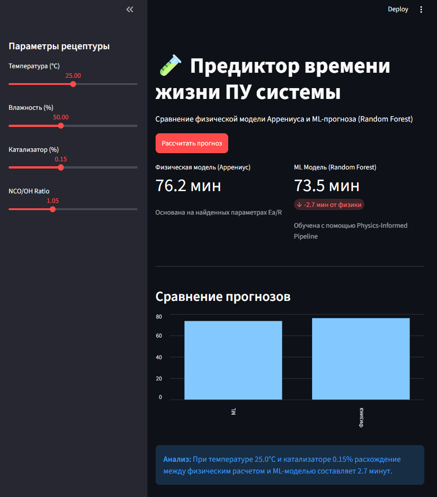

# 🧪 Poly-Kinetics: Physics-Informed ML для предсказания кинетики отверждения полиуретанов

**Poly-Kinetics** — это R&D-проект на стыке химической кинетики и машинного обучения, направленный на предиктивную аналитику «времени жизни» (pot life) полиуретановых эластомеров. Проект демонстрирует применение подхода **Physics-Informed Machine Learning (PIML)** для промышленных задач.

## 🏭 Бизнес-контекст (Проблема и Решение)
**Проблема:** Скорость застывания полиуретановых систем нелинейно зависит от температуры. Ошибки в расчете технологического окна (Pot Life) приводят к преждевременной полимеризации в оборудовании, росту брака и простоям производственных линий.
**Решение:** Разработан предиктивный инструмент, который на основе физического уравнения Аррениуса вычисляет энергию активации ($E_a$) эластомера по нескольким базовым замерам и генерирует точный график кинетики отверждения для любых температурных режимов.

## ✨ Ключевые особенности
*   **Physics-Informed Data Generation:** Генератор синтетических данных базируется на фундаментальных термодинамических законах (уравнение Аррениуса) с учетом влияния температуры, концентрации катализатора и влажности.
*   **Гибридное моделирование:** Проведено A/B сравнение интерпретируемой физико-математической модели и ансамблевых ML-алгоритмов (Random Forest).
*   **Production-Ready архитектура:** Проект имеет строгую модульную структуру с использованием принципов ООП. Логика расчетов (`src/`) сепарирована от пользовательского интерфейса (`app/`).
*   **Интерактивный UI:** Реализовано веб-приложение на **Streamlit** для тестирования гипотез и визуализации кинетических кривых в реальном времени.

## 📊 Результаты и метрики
> * **Точность (Random Forest):** Модель показала высокую предиктивную способность с коэффициентом детерминации $R^2$ = **0.9340** и средней абсолютной ошибкой (MAE) всего **7.28** мин.
> * **Физическая консистентность:** В ходе аппроксимации синтетических данных алгоритм успешно восстановил скрытые термодинамические параметры системы: эффективная энергия активации $E_a/R$ = **3806.76** (положительное значение, так как время жизни ПУ обратно пропорционально константе скорости реакции) и фактор соударений $\ln(A)$ = **-8.43**, доказав математическую корректность генератора данных.
> * **Интерпретируемость:** Анализ `feature_importances_` подтвердил, что ключевым драйвером кинетики в модели выступает дозировка катализатора и сгенерированный физический признак обратной температуры (`temp_kelvin_inv`), что полностью согласуется с теорией полимеризации полиуретанов.

  

## 🚀 Быстрый запуск (Quick Start)

1. Клонируйте репозиторий:
\`\`\`bash
git clone https://github.com/your-username/poly-kinetics.git
cd poly-kinetics
\`\`\`

2. Установите зависимости:
\`\`\`bash
pip install -r requirements.txt
\`\`\`

3. Запустите веб-интерфейс:
\`\`\`bash
streamlit run app/main.py
\`\`\`

## 📂 Структура проекта
\`\`\`text
poly-kinetics/
├── README.md               # Описание проекта
├── requirements.txt        # Зависимости Python
├── data/                   # Сырые и обработанные датасеты
├── models/                 # Сохраненные веса (.json, .joblib)
├── src/                    # Ядро логики (ArrheniusKinetics)
├── notebooks/              # Jupyter-ноутбуки с EDA и ML-пайплайном
└── app/                    # Исходный код Streamlit-приложения
\`\`\`